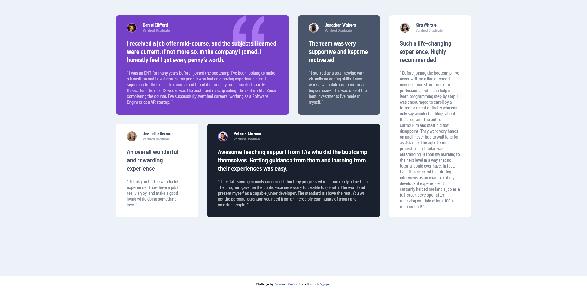
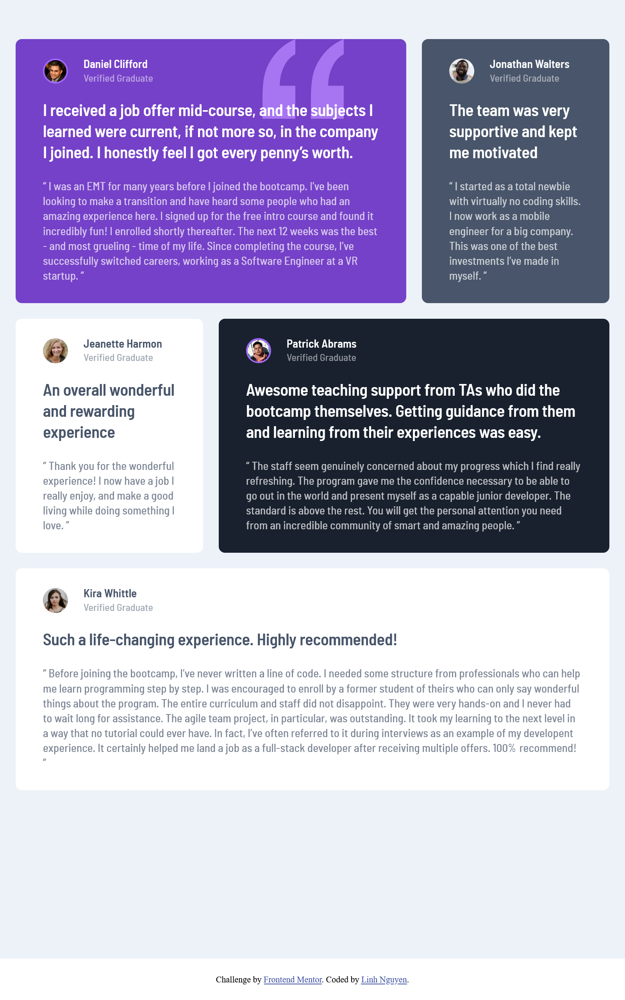

# Frontend Mentor - Testimonials grid section! Welcome! 👋👋👋

## Table of contents

- [Overview](#overview)
  - [The challenge](#the-challenge)
  - [Screenshot](#screenshot)
  - [Links](#links)
- [My process](#my-process)
  - [Built with](#built-with)
  - [What I learned](#what-i-learned)
  - [Continued development](#continued-development)
  - [Useful resources](#useful-resources)
- [Author](#author)


## Overview

### The challenge


Users should be able to:

- View the optimal layout for the site depending on their device's screen size


### Screenshot

_1. Desktop design:_



_2. Tablet design:_



_3. Mobile design:_


### Links

<!-- - Solution URL: [Add solution URL here](https://your-solution-url.com) -->
- Live Site URL: [Add live site URL here](https://your-live-site-url.com)

## My process

### Built with

- Semantic HTML5 markup
- CSS custom properties
- Flexbox
- CSS Grid
- Mobile-first workflow

### What I learned

- How to use grid to achieve the desired design.

```css
/* For tablet*/
@media only screen and (min-width: 768px) {
  .review__wrapper {
    grid-template-columns: repeat(3, 1fr);
    grid-template-rows: auto auto auto;
    gap: 20px;
  }

  .review__card:nth-child(1){
    grid-column: 1 / span 2;
  }

  .review__card:nth-child(4){
    grid-column: 2 / span 2;

  }
  
  .review__card:nth-child(5){
    grid-column: 1 / span 3;
    grid-row: 3;
  }
}
/* For desktop*/
@media only screen and (min-width: 992px) {
  .review__wrapper {
    grid-template-columns: repeat(4, 1fr);
    grid-template-rows: auto auto;
    gap: 30px;
  }

  .review__card:nth-child(1){
    grid-column: 1 / span 2;
  }
  
  .review__card:nth-child(4){
    grid-column: 2 / span 2;

  }
  
  .review__card:nth-child(5){
    grid-column: 4 / 5;
    grid-row: 1 / span 2;
  }
}

```

### Useful resources

- [CSS :nth-child() Selector from W3School](https://www.w3schools.com/cssref/sel_nth-child.php) - How to select an specific element in CSS.
- [Self-hosting fonts explained (including Google fonts) // @font-face tutorial from Kevin Powell](https://www.youtube.com/watch?v=zK-yy6C2Nck&t=67s) - How to use @font-face in CSS.
- [Realizing common layouts using grids from MDN Web docs](https://developer.mozilla.org/en-US/docs/Web/CSS/CSS_grid_layout/Realizing_common_layouts_using_grids) - How to use grid to build common layouts.

## Author

- Frontend Mentor - [@auri222](https://www.frontendmentor.io/profile/auri222)


